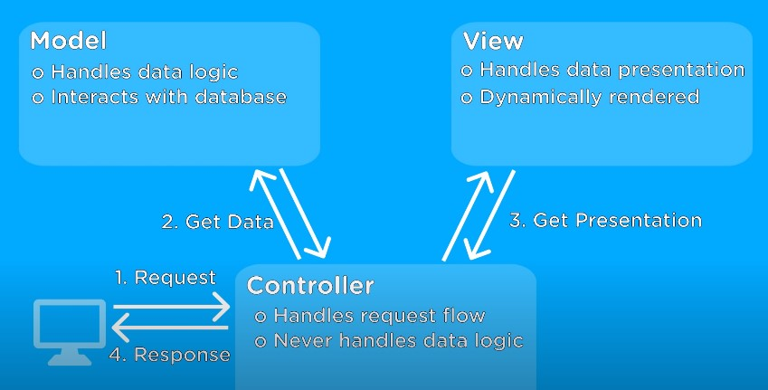

# MVC (Model - View - Controller)

- Model View Controller is a software architectural pattern for implementing user interfaces on computers.
- It divides a given application into three interconnected parts. This is done to separate internal representations of information from the ways information is presented to, & accepted from the user.
- The MVC design pattern decouples these major components allowing for efficient code reuse and parallel development.
- MVC is one of the most frequently used industry-standard web development frameworks to create scalable and extensible projects. 

**Model :** Database operation such as fetch data or update data, etc  
**View :** End user GUI through which user can interact with system i.e. HTML, CSS  
**Controller :** Contain Business logic and provide lint between model and view.
